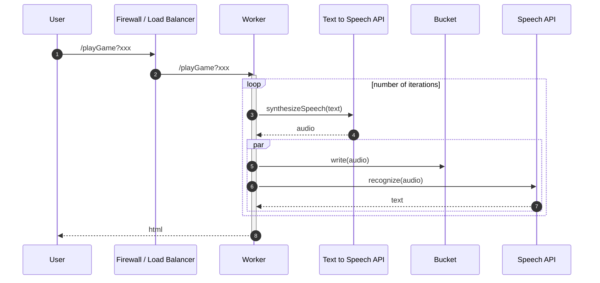

# whispers

A Google Cloud Platform (GCP) Playground  
Discovering how to run Node.js.  
The party game '[Chinese Whispers](https://en.wikipedia.org/wiki/Telephone_(game))' (in the US, 'telephone') with Google's speech API's.

## Options

* src: https://www.edureka.co/blog/what-is-google-cloud-platform/

| GCP product | Type | Unit | Abstraction level | Usage | Billing | Project focus |
| --- | --- | --- | --- | --- | --- | --- |
| Cloud Functions | FAAS | function | event, functions | events | usage | dev |
| App Engine | PAAS  | app | code, http requests | web applications | usage | dev |
| Cloud Run | CAAS | container | containers | HTTP(S) workloads | usage, provision | dev(/ops) |
| Kubernetes Engine | CAAS(?)| container | managed services | containerised apps | provision | ops|
| Compute Engine | IAAS | virtual machines | applications | legacy migration | provision | ops |

* [Where should I run my code?](https://www.youtube.com/watch?v=wzPmgWJ5fpU&feature=youtu.be)
* _"definition of enterrpise - any environments where most of the applications do not have an applications team working
  on them"_
* also https://cloud.google.com/serverless-options/   
  
## Function Spec
(Generated with [mermaid.js](https://mermaid-js.github.io/mermaid/#/) - if you see markdown rather than a diagram, [click here](./images/functional-spec.png))

## [Cloud Functions](./docs/CloudFunctions.md)

## [Cloud Run](./docs/CloudRun.md)
