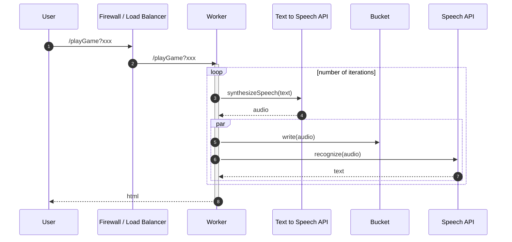

# whispers

A Google Cloud Platform (GCP) Playground  
Discovering how to run Node.js.  
The party game '[Chinese Whispers](https://en.wikipedia.org/wiki/Telephone_(game))' (in the US, 'telephone') with Google's speech API's.

## Options

* src: https://www.edureka.co/blog/what-is-google-cloud-platform/

| GCP product | Type | Unit | Abstraction level | Usage | Billing | Project focus |
| --- | --- | --- | --- | --- | --- | --- |
| Cloud Functions | FAAS | function | event, functions | events | usage | dev |
| App Engine | PAAS  | app | code, http requests | web applications | usage | dev |
| Cloud Run | CAAS | container | containers | HTTP(S) workloads | usage, provision | dev(/ops) |
| Kubernetes Engine | CAAS(?)| container | managed services | containerised apps | provision | ops|
| Compute Engine | IAAS | virtual machines | applications | legacy migration | provision | ops |

* [Where should I run my code?](https://www.youtube.com/watch?v=wzPmgWJ5fpU&feature=youtu.be)
* _"definition of enterrpise - any environments where most of the applications do not have an applications team working
  on them"_
* also https://cloud.google.com/serverless-options/   
  
## Function Spec
(Generated with [mermaid.js](https://mermaid-js.github.io/mermaid/#/) - if you see markdown rather than a diagram, [click here](./images/functional-spec.png))

## Cloud Functions

### URL's

#### Base

* https://europe-west2-numical-telephone.cloudfunctions.net/playGame

#### Params

* https://europe-west2-numical-telephone.cloudfunctions.net/playGame?iterations=5
* https://europe-west2-numical-telephone.cloudfunctions.net/playGame?text=She%20sells%20sea%20shells%20on%20the%20sea%20shore
* https://europe-west2-numical-telephone.cloudfunctions.net/playGame?voice=english
* https://europe-west2-numical-telephone.cloudfunctions.net/playGame?voice=random

#### All Together

* https://europe-west2-numical-telephone.cloudfunctions.net/playGame?iterations=5&text=round%20the%20rugged%20rock%20the%20ragged%20rascal%20ran&voice=random

### Source
* gcp: [setup](./docs/setup.md);
* javascript: https://github.com/numical/whispers/

#### History (tags)

1. [01_trivial_cloud_function](https://github.com/numical/whispers/releases/tag/01_trivial_cloud_function)
2. [02_write_to_bucket](https://github.com/numical/whispers/releases/tag/02_write_to_bucket)
3. [03_create_audio_file](https://github.com/numical/whispers/releases/tag/03_create_audio_file)
4. [04_audio_to_text](https://github.com/numical/whispers/releases/tag/04_audio_to_text)
5. [05_parametrised_plus_international](https://github.com/numical/whispers/releases/tag/05_parametrised_plus_international)
6. [06-add-timings](https://github.com/numical/whispers/releases/tag/06_add_timings)
7. [07-use-functions-framework-for-local-run](https://github.com/numical/whispers/releases/tag/07-use-functions-framework-for-local-run)
8. [08-switch-gcp-project-and-docs](https://github.com/numical/whispers/releases/tag/08-switch-gcp-project-and-docs)

### Conclusions

* straight-forward development
    * idiomatic code
    * some minor constraints
        * index.js at root
        * no background processes
        * temp files in memory
    * cold start considerations
        * globals are good!
        * https://www.youtube.com/watch?v=IOXrwFqR6kY
* unit testing fine
    * mocks for other services
* deployment easy
    * few IAM considerations
* integration testing harder
    * logging only
    * limited service info
    * cloud debugging not formally supported
* **but** low density - concurrency of 1
    * https://cloud.google.com/functions/docs/concepts/exec#auto-scaling_and_concurrency
    * https://cloud.google.com/functions/pricing
        * insanely cheap but inefficient
    * [documentation](https://cloud.google.com/serverless-options/#advanced-tips-and-best-practices) on this issue very limited
    * solution?
        * https://www.nearform.com/blog/solving-the-serverless-concurrency-problem-with-google-cloud-run/

### Possible Next Steps

* use [Cloud Tasks](https://cloud.google.com/tasks) for bucket writes to shorten response *if* they are critical path
* use [Google secrets](https://cloud.google.com/secret-manager) for configuration
* use [Cloud Endpoint](  https://cloud.google.com/endpoints/docs/openapi/get-started-cloud-functions) for custom domain
* understand connection details when using Cloud SQL etc.

### Resources
* [Effective NodeJS Apps on Cloud Functions (recent Google blog post)](https://cloud.google.com/blog/products/serverless/running-effective-nodejs-apps-on-cloud-functions)
* [Open Cloud Function Issues](https://issuetracker.google.com/savedsearches/559729)

    
## Cloud Run

... TBD

* [pricing](https://cloud.google.com/run/pricing)
* [custom domain](https://cloud.google.com/run/docs/mapping-custom-domains)