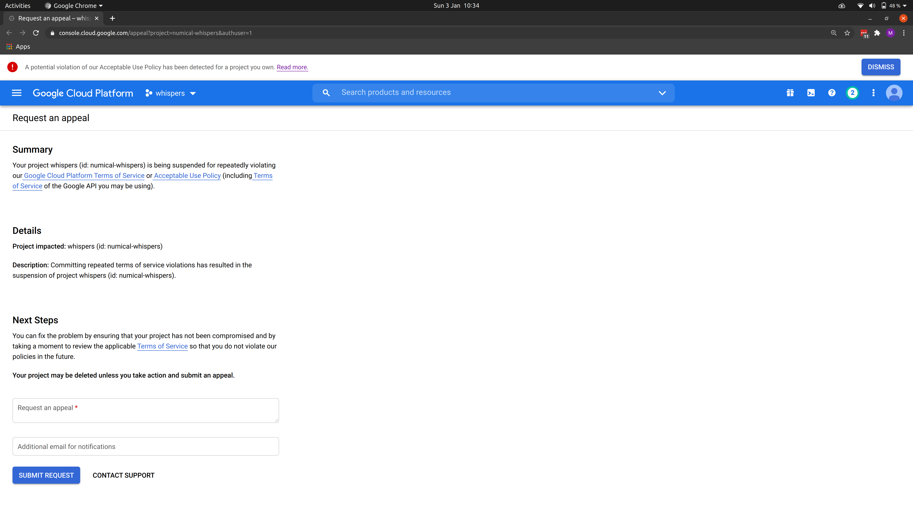

# Algorithm Victim
The story so far:

## 03/01/2021
The Problem:


## 04/01/2021
Without any comms from Google, mainly fixed.  
I say 'mainly' as I can, through the console:
- run cloud functions
- create a new VM instance
- administer buckets etc.

However when I attempt to use the Cloud SDK to upload a new version of my cloud function, I receive the following error:

HTTPError 403:
```xml
<?xml version='1.0' encoding='UTF-8'?><Error><Code>UserProjectAccountProblem</Code><Message>User project billing account not in good standing.</Message><Details>The billing account for the owning project is disabled in state absent</Details></Error>
```
Note that in the console, as best I can see my billing account seems fine. 

After an hour on a chat with Billing support, they found nothing.
However I discovered that a new project did not suffer the same deploy issue.
So fixed myself.
Fine as I could delete the project.
For real code would need proper support:
https://cloud.google.com/support#support-plans
Expensive.