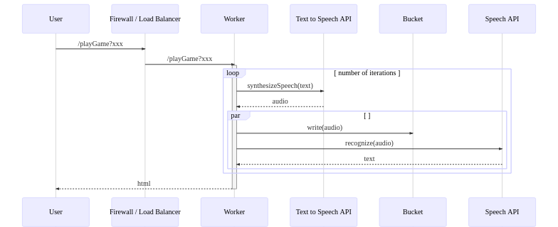
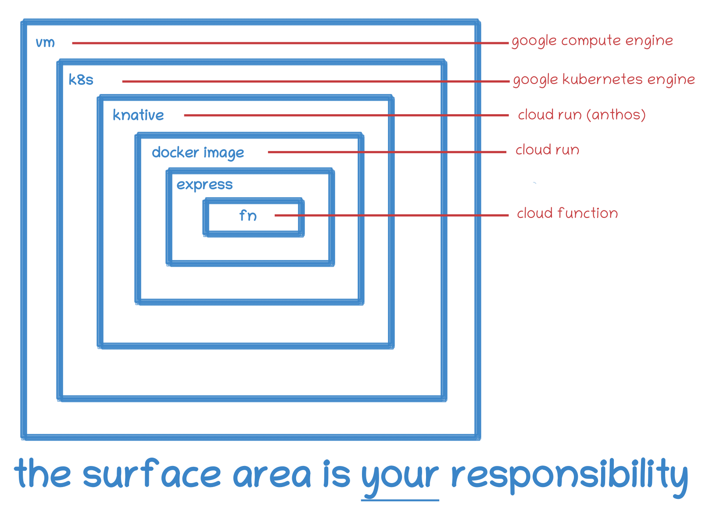

# GCP - it's nearly free!

## Previously ... on Eng Guild
* in January, started on a contrary appraisal of GCP
* as opposed to a dev-ops heavy enterpise viewpoint
* wanted to look at a dev-focussed approach >> serverless
* looked at [Cloud Functions](./CloudFunctions.md) and [Cloud Run](./CloudRun.md)
* came decisively down on the Cloud Run side

### [Chinese Whispers Demo]((https://wealthhealth.dev/whispers))

# Can I build _and run_ a fully fledged web proposition for free on GCP?

## Free Stuff
* [Free Tier Products](https://cloud.google.com/free)
* have to consider why do Google do this
* and more pertinently for how long will they do this?
  
## Compute OK
* compute - OK
  * taking a look at the GCP Onion:
    

## BUT Missing Stuff
* check out the [price calculator](https://cloud.google.com/products/calculator/)
* custom domain (see [Static Website](./StaticWebsite.md))
* storage
  * buckets
  * structured (databases) 
    
## Firebase to the rescue!

### Stacks (my nomenclature):

####Core: 

| GCP product | Type | Unit | Abstraction level | Usage | Billing | Project focus |
| --- | --- | --- | --- | --- | --- | --- |
| Compute Engine | IAAS | virtual machines | applications | legacy migration | provision | ops |
| Kubernetes Engine | CAAS(?)| container | managed services | containerised apps | provision | ops|
| Cloud Run | CAAS | container | containers | HTTP(S) workloads | usage, provision | dev(/ops) |
| Cloud Functions| FAAS | function | event, functions | events | usage | dev |

####And:

| GCP product | Type | Unit | Abstraction level | Usage | Billing | Project focus |
| --- | --- | --- | --- | --- | --- | --- |
| App Engine | PAAS  | app | code, http requests | web applications | usage | dev |

####And Then:

| GCP product | Type | Unit | Abstraction level | Usage | Billing | Project focus |
| --- | --- | --- | --- | --- | --- | --- |
| Firebase | All-in-one  | app | app | mobile applications | usage | dev |

### Mix'n'match
* Firebase for free stuff:
  * [hosting](https://firebase.google.com/docs/hosting/use-cases)
  * [custom domain](https://firebase.google.com/docs/hosting/custom-domain)
* Firestore for free data storage
  * not much but enough and then cheap
* [Integrate with Cloud Run](https://firebase.google.com/docs/hosting/cloud-run)  for functionality

### [Demo - stateless server](https://finances.page/)
* [sequence diagrams](./stateless-server-sequence-diagrams.md)
* detail unimportant, but a **real** app

### Downsides
* dumbed down so, conversely, unintuitive, e.g:
  * schema definition
  * indexes
* not fully automated
  * limited CLI, have to use Console
  * single db
    cannot delete!
* not fully integrated   
    
### Surprise Upsides
* auto-config cloud run instances using [realtime updates](https://firebase.google.com/docs/firestore/query-data/listen)
* easy unit testing as Collections auto-created

## If You're Not Convinced
https://www.nearlyfreespeech.net/