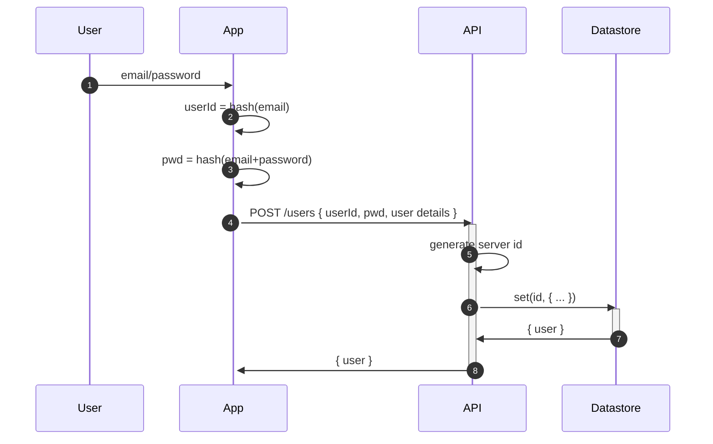
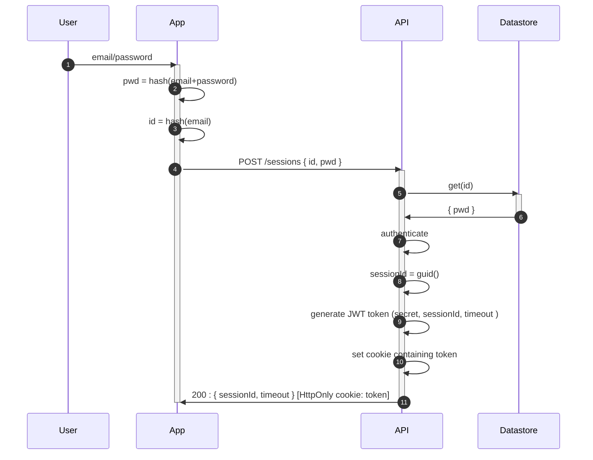
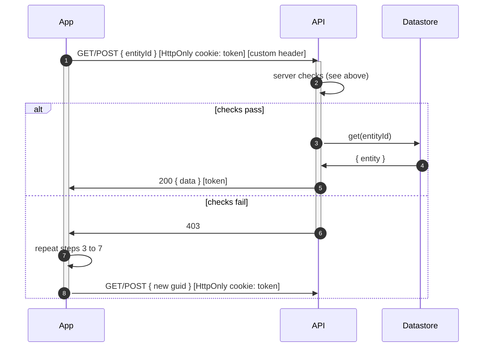

# Stateless Server Interactions

# Create User
* user created on server with:
    * hashed email as userId
    * hashed password salted with email as pwd
* hence
    * from an auth perspective, server never knows email
    * server nevers know password
    

# Create Session
* definition of _session_:
  * a **time limited** window of validity for cookies and tokens
  * a user might require multiple sessions during any one usage of the app
  * the client is responsible for creating a new session before the current one expires
* user authenticated
* once authenticated, the user identity plays no further part in the session management

# Enforce Session
* browser passes HttpOnly Strict SameSite cookie containing JWT token
* client passes custom header with sessionId
* server checks:
  * cookie present
  * cookie not expired
  * JWT can be decrypted
  * JWT not expired 
  * custom header present  
  * JWT payload matches custom header
    

